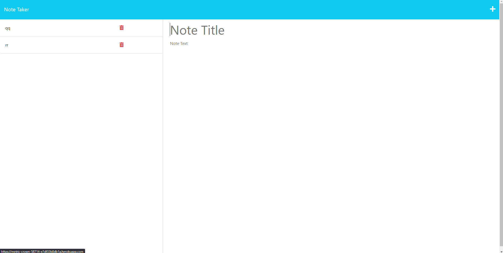

# Note Taker

## Description
This web application was developed in order to give busy people a way to organize tasks and notes that they need to save and reference later. The saved notes are stored in a database and can be deleted when completed or no longer needed.

## Usage
To save notes, type in a note title and a body into the text fields displayed. When ready to save, click on the save icon at the top right of the screen. To start a new note, click on the plus icon at the top right of the screen. In order to view saved notes, simply click on them on the left-hand side when saved notes are displayed. To erase a note, click on the red trash icon at the right of the note in the sidebar.

## Credits
The front end of this application was developed by the University of Denver coding bootcamp. The back end was developed entirely by me, Ron Buttermore.

## License
MIT Open-Source License

Copyright (c) 2023 Ron Buttermore

Permission is hereby granted, free of charge, to any person obtaining a copy of this software and associated documentation files (the "Software"), to deal in the Software without restriction, including without limitation the rights to use, copy, modify, merge, publish, distribute, sublicense, and/or sell copies of the Software, and to permit persons to whom the Software is furnished to do so, subject to the following conditions:

The above copyright notice and this permission notice shall be included in all copies or substantial portions of the Software.

THE SOFTWARE IS PROVIDED "AS IS", WITHOUT WARRANTY OF ANY KIND, EXPRESS OR IMPLIED, INCLUDING BUT NOT LIMITED TO THE WARRANTIES OF MERCHANTABILITY, FITNESS FOR A PARTICULAR PURPOSE AND NONINFRINGEMENT. IN NO EVENT SHALL THE AUTHORS OR COPYRIGHT HOLDERS BE LIABLE FOR ANY CLAIM, DAMAGES OR OTHER LIABILITY, WHETHER IN AN ACTION OF CONTRACT, TORT OR OTHERWISE, ARISING FROM, OUT OF OR IN CONNECTION WITH THE SOFTWARE OR THE USE OR OTHER DEALINGS IN THE SOFTWARE.